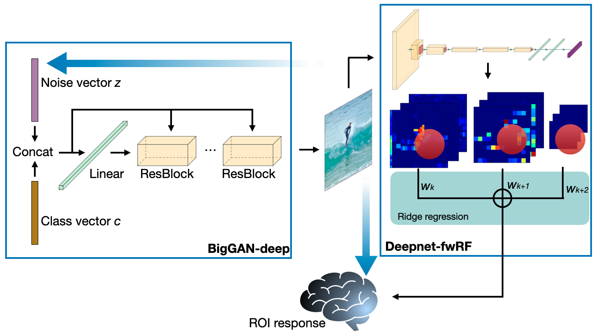

# NeuroGen: activation optimized image synthesis for discovery neuroscience

NeuroGen is a framework for synthesizing images that control brain activations. Details can be found in the preprint: https://arxiv.org/pdf/2105.07140.pdf.
Supplementary Material can be found here: https://drive.google.com/drive/folders/1333yhTqTro6UgRS4sr6WAiR6a-J50PHK?usp=sharing 

## Requirements
* Python 3.7
* Pytorch 1.4.0
* Other basic computing modules

## Instructions
1. `output` directory contains the trained encoding model for 8 subjects in the NSD dataset.
2. `encoding.py` is called when loading the encoding model to NeuroGen.
3. `getROImask.py` is used to get the ROI mask for the 24 used ROIs. 
4. `getmaskedROI.py` is used to get the voxel response within certain ROI.
5. `getmaskedROImean.py` is used to get the mean voxel response within certain ROI.
6. `neurogen.py` is the main script for NeuroGen, and can be called by

`python neurogen.py --roi 1 --steps 1000 --gpu 0 --lr 0.01 --subj 1 --reptime 1 --truncation 1`

7. `visualize.py` contains some useful functions to save images and visualize them.
8. `pytorch_pretrained_biggan` is available here: https://github.com/huggingface/pytorch-pretrained-BigGAN

Note: `getROImask.py`, `getmaskedROI.py` and `getmaskedROImean.py` deal with the NSD data which has not been released yet and are not necessary to run NeuroGen at this time. Paths in all scripts may need to change according to needs.

## Citation
@misc{gu2021neurogen,\
      title={NeuroGen: activation optimized image synthesis for discovery neuroscience}, \
      author={Zijin Gu and Keith W. Jamison and Meenakshi Khosla and Emily J. Allen and Yihan Wu and Thomas Naselaris and Kendrick Kay and Mert R. Sabuncu and Amy Kuceyeski},\
      year={2021},\
      eprint={2105.07140},\
      archivePrefix={arXiv},\
      primaryClass={q-bio.NC}
}
